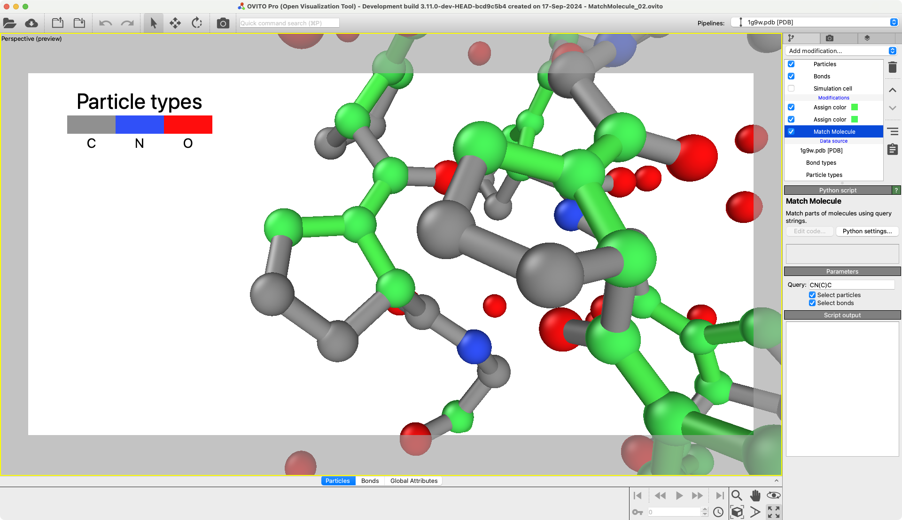

# Match Molecule
Match parts of molecules using SMILES like query strings.

## Description / Examples
This modifier allows you to select sections of molecules using query strings. The queries employ a simplified version of SMILES, [SMILES](https://en.wikipedia.org/wiki/Simplified_Molecular_Input_Line_Entry_System),
where molecules are defined using strings.


> Original by Fdardel, slight edit by DMacks, CC BY-SA 3.0 <http://creativecommons.org/licenses/by-sa/3.0/>, via Wikimedia Commons

### Selecting linear molecules
For example, the string HOH defines the water molecule (H-O-H).

### Adding side chains
Use parentheses `()`, To define more complex molecules. To select the submolecule:
``` 
  O
   \
     N - C - C -
   /
H-O
```
you might use the query string `ON(OH)CC`, where `(OH)` indicates a side chain branching off from the preceding `N` atom.

### Selecting multi-letter elements
To select this group of atoms:
```
- C - Fe -
  |   |
  H   O
      |
      H
```
you could use the query `C(H)"Fe"(OH)`. Multi-letter chemical elements need to be enclosed in single `'` or double quotes `"`. An equivalent formulation would be `C(H)"Fe"OH`.

### Adding wildcards / placeholders
Use the `?` wildcard to match multiple sub-molecules. For instance, `H?H` matches both the `H-O-H` and `H-N-H` molecules (and any other molecule where two `H` atoms are connected by a single bridge atom).

### Creating additional bonds
This syntax can be limiting, so you might need to manually add bonds to your string. To select this group of atoms:
```
- C - N 
    /   \*
   C      C - C -
   \     /
    C - C
```
Use `CNCCCCC` to select all atoms in this sub-molecule. This would give you the following selection:
```
- C - N 
    /   
   C      C - C -
   \     /
    C - C
```
where one ring closing bond is missing. Numerical tags can be used to include this bond (marked with `*` in the initial image). The query string `CN1CCCC1C` correctly selects all atoms and bonds shown in the image, including the bond marked with `*`:
```
- C - N1
    /   \*
   C      C1 - C -
   \     /
    C - C
```
All atoms tagged with the same number will be linked, here `N1` and `C1` both having numerical tag `1`.

### Application selecting O-C-O
To select all O-C-O groups in this molecule:

the following query string `OCO` can be used:

This example can be found in *examples/Example_01.ovito* and *examples/Example_01.py*.

### Application selecting rings and bridge atoms
To select all 5 rings containing 4 C and 1 N atom from this structure:

The query string `N1CCCC1` can be used:

Here the `N1` and `C1` tags have to be used to ensure that the ring is closed. The position of the closing bond is not unique.

Alternative to select:
```
C
 \
   N - C
 /
C
```
The query string `CN(C)C` can be used. The resulting selection is shown here:


These two examples can be found in *examples/Example_02.ovito*, *examples/Example_02.py*, *examples/Example_03.ovito*, and *examples/Example_03.py*.

## Parameters 

| GUI name             | Python name       | Description                                                       | Default value |
|----------------------|-------------------|-------------------------------------------------------------------|---------------|
| **Query**            | `query`           | Query string used to select atoms and bonds.                      | `""`          |
| **Select particles** | `selectParticles` | Create a selection for the particles defined by the query string. | `True`        |
| **Select bonds**     | `selectBonds`     | Create a selection for the bonds defined by the query string.     | `True`        |


## Installation
- OVITO Pro [integrated Python interpreter](https://docs.ovito.org/python/introduction/installation.html#ovito-pro-integrated-interpreter):
  ```
  ovitos -m pip install --user git+https://github.com/ovito-org/MatchMolecule.git
  ``` 
  The `--user` option is recommended and [installs the package in the user's site directory](https://pip.pypa.io/en/stable/user_guide/#user-installs).

- Other Python interpreters or Conda environments:
  ```
  pip install git+https://github.com/ovito-org/MatchMolecule.git
  ```

## Technical information / dependencies
- Tested on OVITO version 3.10.6

## Contact
- Daniel Utt (utt@ovito.org)
